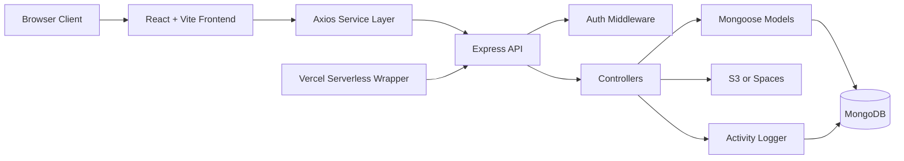
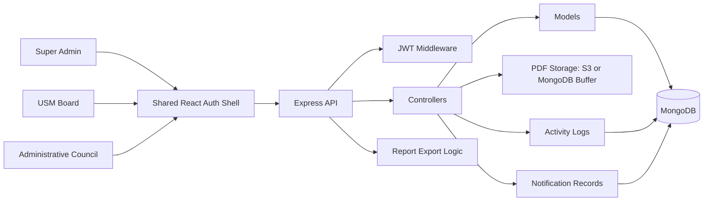

# Architecture Diagram

## Reference System

## Planned USM System

## Architectural Direction

- Keep the runtime topology identical to the reference repo.
- Replace the SUC agenda domain with an Administrative Council submission domain.
- Reuse the same client shell, upload pattern, PDF viewer pattern, and audit logging pattern.
- Add a notification module and system settings module without changing the overall shape.