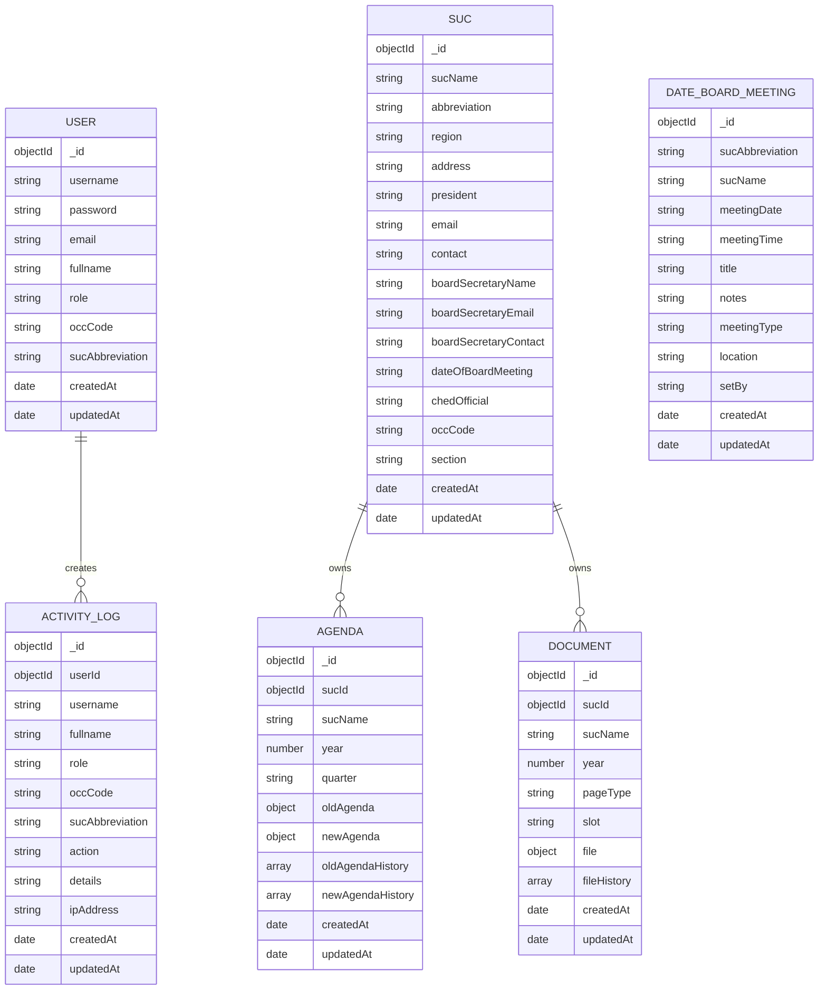
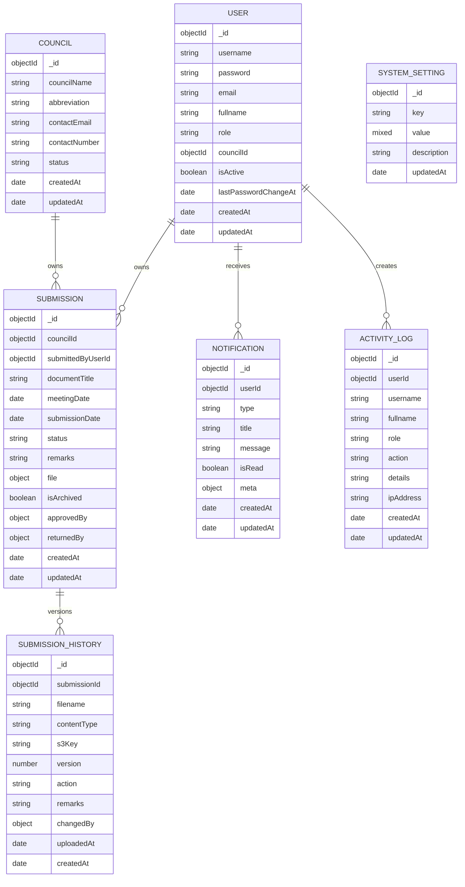

# Database ERD

## Reference Repository ERD

## Planned USM System ERD

## Design Notes for the New System

- `Council` replaces `Suc` as the primary organization entity.
- `Submission` replaces the combined `Agenda` and `Document` domain.
- One active submission per council is enforced by controller logic and unique indexing.
- `SubmissionHistory` preserves prior uploads when a council replaces a returned document.
- `Notification` and `SystemSetting` are additive modules not present in the reference repo, but they fit the same model/controller pattern.