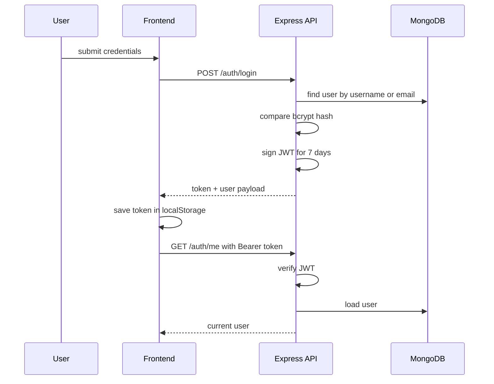
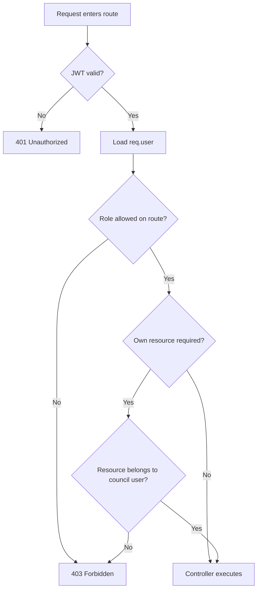

# Authentication Flow

## Reference Flow

## Planned USM Flow

### Login

1. User submits username and password.
2. Backend validates credentials using bcrypt.
3. Backend issues JWT with role and user id payload.
4. Frontend stores token in `localStorage`.
5. Frontend restores state using `GET /auth/me`.

### Protected Route Pattern

1. Axios interceptor attaches `Authorization: Bearer <token>`.
2. `authenticate` middleware verifies the token.
3. Middleware fetches the user and attaches `req.user`.
4. Route middleware checks role.
5. Controller applies resource-level ownership constraints.

### Role Guards for USM

- `superAdminOnly`
- `boardOnly`
- `councilOnly`
- `boardOrSuperAdmin`

### Resource Ownership Rules

- Super Admin: unrestricted
- USM Board: can view all submissions and act on review states
- Administrative Council: can view and mutate only its own submission

## Planned Authorization Matrix in Flow Form

## Security Decisions to Preserve or Improve

### Preserve

- JWT-based stateless auth
- bcrypt password hashing
- middleware-centered enforcement

### Improve During Implementation

- avoid query-string tokens for file access if possible
- add rate limiting for login and upload endpoints
- centralize request validation
- log password reset and approval actions explicitly