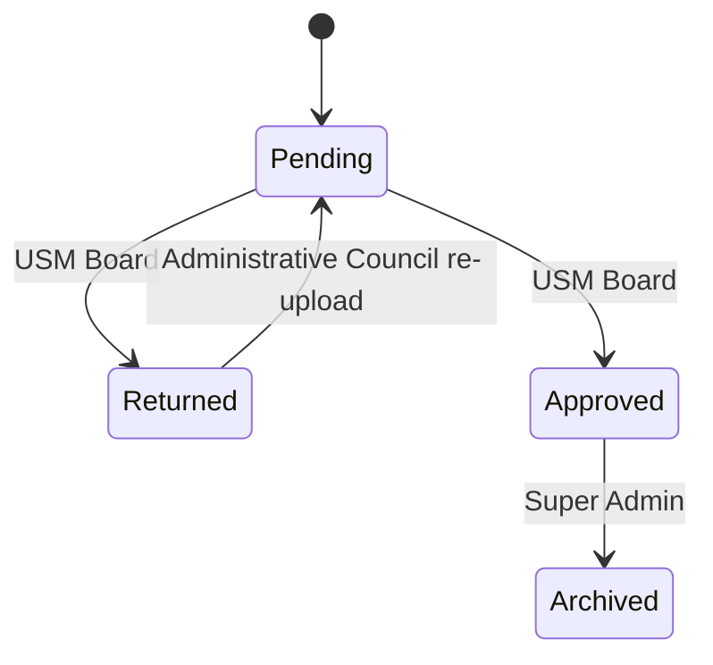

# Role Matrix

## Target Roles

| Capability | Super Admin | USM Board | Administrative Council |
| --- | --- | --- | --- |
| Login | Yes | Yes | Yes |
| View own profile | Yes | Yes | Yes |
| Change own password | Yes | Yes | Yes |
| Create users | Yes | No | No |
| Edit users | Yes | No | No |
| Delete users | Yes | No | No |
| Reset passwords | Yes | No | No |
| View all councils | Yes | Yes | No |
| Manage councils | Yes | No | No |
| View all submissions | Yes | Yes | No |
| View own submission | Yes | Yes | Yes |
| Upload initial PDF | No | No | Yes |
| Replace uploaded PDF before approval | No | No | Yes |
| Download submitted PDF | Yes | Yes | Own only |
| Return submission with remarks | No | Yes | No |
| Approve submission | No | Yes | No |
| Archive approved submission | Yes | No | No |
| View reports | Yes | Yes | No |
| Export PDF reports | Yes | Yes | No |
| Export Excel reports | Yes | Yes | No |
| Print reports | Yes | Yes | No |
| View activity logs | Yes | No | No |
| Manage settings | Yes | No | No |
| Receive notifications | Yes | Yes | Yes |

## Route Guard Mapping

| Guard | Allowed Roles |
| --- | --- |
| `authenticate` | all roles |
| `superAdminOnly` | superadmin |
| `boardOnly` | board |
| `councilOnly` | council |
| `boardOrSuperAdmin` | superadmin, board |

## Data Visibility Rules

| Resource | Super Admin | USM Board | Administrative Council |
| --- | --- | --- | --- |
| Users | all | none | none |
| Councils | all | all | own profile-linked council only if needed for display |
| Submissions | all | all | own only |
| Notifications | all own | own | own |
| Logs | all | none | none |
| Settings | all | none | none |

## Status Transition Permissions

